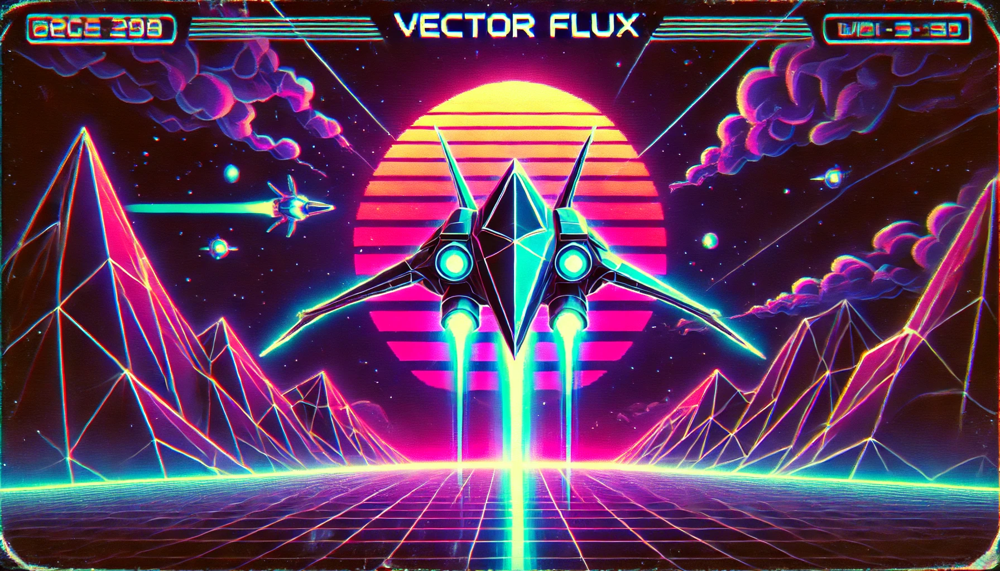

# Vector Flux

A retro-futuristic arcade space shooter with vibrant neon visuals and dynamic gameplay.



## Game Overview

Vector Flux is a browser-based arcade space shooter featuring:
- Vibrant neon visuals with retro-futuristic aesthetics
- Dynamic gameplay with precision targeting system
- Shield mechanics and hull integrity management
- Enemy waves with increasing difficulty
- Particle effects and screen shake for immersive feedback
- Synthwave soundtrack to enhance the retro atmosphere

## How to Play

### Controls

- **Arrow Keys**: Move your ship (Up, Down, Left, Right)
- **Spacebar**: Fire weapons
- **Escape**: Pause/Resume game

### Gameplay Mechanics

1. **Movement**: Control your ship with the arrow keys to navigate the battlefield.
2. **Targeting System**: Your shots will travel through your targeting sight, allowing for precision aiming.
3. **Shields**: Your ship has shields that absorb damage before your hull takes hits.
4. **Hull Integrity**: Once shields are depleted, your hull takes damage. If hull integrity reaches zero, the game is over.
5. **Enemies**: Various enemy types will attack with different patterns and weapons.
6. **Power-ups**: Collect power-ups to restore shields, repair hull, or enhance weapons.

## Installation

### Local Setup

1. Clone the repository:
```
git clone https://github.com/jham323/VectorFluxGame.git
```

2. Navigate to the project directory:
```
cd VectorFluxGame
```

3. Open `index.html` in your web browser to play the game.

### Playing Online

You can also play Vector Flux directly in your browser by visiting [GitHub Pages URL when available].

## Technical Details

- Built with vanilla JavaScript and HTML5 Canvas
- No external libraries or frameworks required
- Responsive design that adapts to different screen sizes
- Optimized for modern browsers

## Audio Credits

The game features synthwave tracks to enhance the retro-futuristic atmosphere:
- "Dreams" - Background music
- "Cosmos" - Alternative background track

## Development

Vector Flux was developed as a passion project to explore canvas-based game development and retro-futuristic aesthetics.

### Future Enhancements

- Additional enemy types and boss battles
- Weapon upgrades and special abilities
- Level progression system
- Local high score tracking
- Mobile touch controls

## License

This project is available under the MIT License. See the LICENSE file for more details.

## Contact

For questions, suggestions, or feedback, please open an issue on the GitHub repository.

---

Enjoy the neon-soaked action of Vector Flux! 
